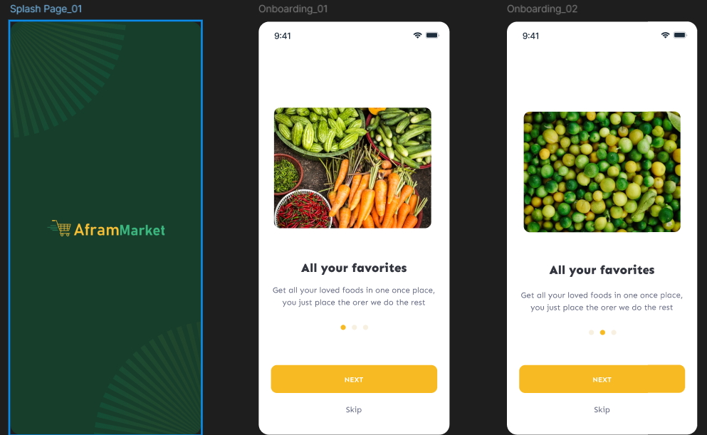

# afram_project

## Afram Market Application
Afram Market is a cross-platform mobile application built with Flutter that connects users, vendors, and drivers 
in the agricultural marketplace. Vendors can upload their products, users can purchase them, and drivers 
deliver the products directly to the users' doorsteps.

## Features
    User Authentication: Secure login and registration for users, vendors, and drivers.
    Vendor Portal:
        Upload and manage products with images, descriptions, and pricing.
        Inventory management and order tracking.
    User Experience:
        Browse and search for agricultural products.
        Shopping cart and secure checkout process.
        Order history and real-time order tracking.
    Driver Dashboard:
        View assigned deliveries with route navigation.
        Update delivery status in real-time.
    Real-Time Notifications: Push notifications for order confirmations, status updates, and delivery alerts.
    Payment Integration: Support for multiple payment gateways for seamless transactions.
    Ratings and Reviews: Users can rate products and vendors to ensure quality service.
    Multi-Language Support: Available in multiple languages for broader accessibility.
    Responsive Design: Optimized for both Android and iOS devices.

## Getting Started

## Usage
    For Users
        Registration and Login: Sign up with email or social media accounts.
        Browse Products: Explore a wide range of agricultural products.
        Search and Filter: Find products using categories, keywords, and filters.
        Add to Cart: Select products and add them to the shopping cart.
        Checkout and Payment: Securely pay using integrated payment gateways.
        Order Tracking: Monitor the status of your orders in real-time.
        Reviews: Provide feedback on products and vendors.
    For Vendors
        Account Creation: Register as a vendor with necessary credentials.
    Product Management:
        Upload new products with details and images.
        Edit or remove existing product listings.
        Inventory Control: Keep track of stock levels and update inventory.
        Order Management: View incoming orders and update order statuses.
        Sales Analytics: Access reports on sales performance and earnings.
    For Drivers
        Driver Registration: Sign up to become a delivery driver.
        View Delivery Assignments: Access a list of orders assigned for delivery.
        Navigation Assistance: Integrated maps for route optimization.
        Update Delivery Status: Mark orders as picked up, in transit, or delivered.
        Earnings Tracker: Monitor delivery earnings and payment history.

- [Lab: Write your first Flutter app](https://docs.flutter.dev/get-started/codelab)
- [Cookbook: Useful Flutter samples](https://docs.flutter.dev/cookbook)

For help getting started with Flutter development, view the
[online documentation](https://docs.flutter.dev/), which offers tutorials,
samples, guidance on mobile development, and a full API reference.
